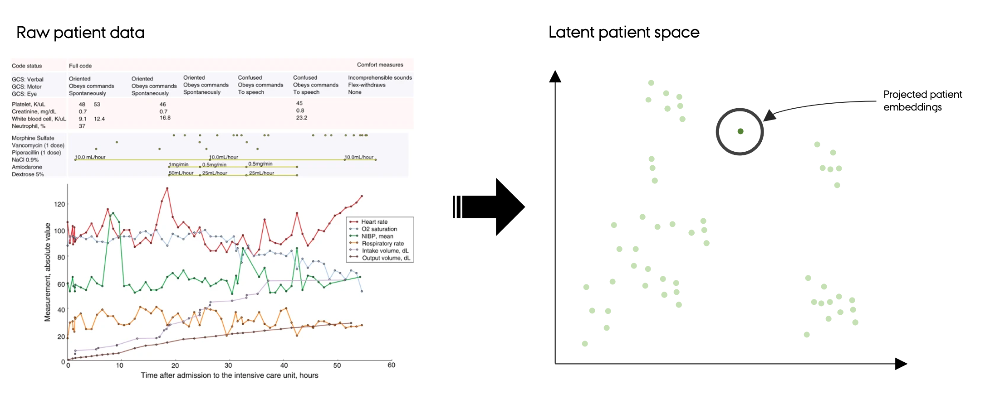
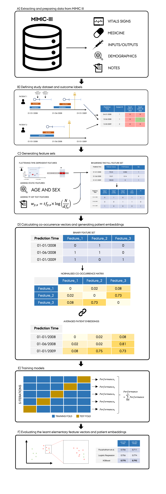

<br />
  <h1 align="center">Elementary Multimodal Clinical Feature Vectors: Encoding structured, time series and free-text data from ICU electronic health records into a common clinical semantic space
 </h1>
 <h2 align="center">Master's Thesis, Cognitive Sceince @ Aarhus University 2023</h2>

  <p align="center">
    Jakob Grøhn Damgaard
    <br />
</p>

<!-- TABLE OF CONTENTS -->
<details open="open">
  <summary>Table of Contents</summary>
  <ol>
    <li><a href="#about-the-project">About the project</a></li>
    <li><a href="#summary">summary</a></li>
    <li><a href="#graphical-representation-of-pipeline>"Graphical representation of pipeline</a></li>
    <li><a href="#repository-structure">Repository structure</a></li>
    <li><a href="#data-statement">Data statement</a></li>
  </ol>
</details>

<!-- ABOUT THE PROJECT -->
## About the project
The repository contains the source code used for my Master's Thesis in Cognitive Sceince @ Aarhus University 2023. A summary of the project is presented below. 

<!-- THESIS SUMMARY -->
## Summary

The ongoing accumulation of rich electronic health data, combined with the rapid progression of machine learning and expansion of computational resources, holds the potential to improve healthcare using data-driven solutions. However, machine learning in the clinical domain is afflicted by inherent challenges due to the nature of data; electronic health records are complex, high- dimensional, noisy and heterogeneous. These attributes make it non-trivial to model all the available patient information in a unified framework.
<br />

Recently, studies have explored transferring concepts and algorithms from natural language processing and the principles of distributional semantics to the clinical domain. Treating discrete structured medical entities such as diagnosis codes as words, researchers have trained clinical concept embeddings that encode the semantic properties of these entities. The reviewed implementations are, however, still limited to an extent where they have little clinical utility. Expanding on these endeavours, I propose a novel framework for learning elementary multimodal clinical feature vectors. These embeddings are intended to be used as pre-trained inputs in downstream clinical modelling tasks such as outcome prediction.
<br />

The key novel asset of the proposed representation learning method is its ability to flexibly adapt to data stemming from any data modality and encode temporal dependencies. The overarching conceptual method can be divided into three components: 1. decomposing the data describing each patient at a given time point into elementary discrete patient features that encode information such as ‘Has the patient had high blood pressure in the last 24 hours?’. 2. Extracting a large set of such elementary features at fixed time points and embedding them into a shared vector space using co-occurrence patterns to capture semantic properties and inter-feature relations. 3. Employing these latent elementary feature vectors as input in downstream clinical modelling tasks. In some instances, this could involve reassembling the constituent feature vectors into rich latent patient embeddings.
<br />

This paper constitutes a preliminary investigation of the proposed framework using a proof-of-concept experimental pipeline and ICU data from the MIMIC- III database. To construct the experimental pipeline, a set of multimodal elementary, discrete features are derived based on the task of predicting patient mortality. Next, these elementary features are projected into a common space using cooccurrence statistics to obtain feature vectors. Lastly, patient embeddings are computed at each prediction time for the mortality task by averaging the learnt feature vectors. The performance of the patient embeddings on the mortality task using regularised logistic regression and XGBoost classifiers are compared to benchmark models from work by (Purushotham et al., 2018). The patient embeddings demonstrate promising results, given the inherent constraints of the proof-of-concept implementation. On both a short- and long-term mortality prediction task, the patient embeddings outperformed the SAPS II severity score-based mortality estimation tool (an AUROC increase of 2.8 and 2.1 percentage points, respectively). They even approached the abilities of SuperLearner-based models trained on full raw feature sets. To gain insight into the semantic properties of the derived embeddings, they were projected into a 2D space using t-SNE and coloured by various attributes. These visualisations confirm that the pipeline managed to encode accurate semantic properties as well as inter-feature and cross-modal relations.
<br />

Moving forward, focus should be put on further developing the methods and algorithms for embedding the elementary multimodal clinical feature vectors and generating patient embeddings. Such advances would enable the framework to represent the features and, ultimately, the state of a patient in more detail and, thus, provide better performance. Given the range of concrete methods to pursue in these regards and the promising results of this preliminary study, there are reasons to believe that the proposed framework may have broad applications in clinical machine learning tasks in a future form.

### Compact graphical representation of the conceptual pipeline


<!-- THESIS SUMMARY -->
## Graphical representation of pipeline
The following graphical flowchart depicts the entire experimantal pipeline from extracting raw data from the MIMIC-III database to evaluating the utility of the final latent elementary feature vectors and patientr embeddings:



<!-- REPOSITORY STRUCTURE -->
## Repository structure

The source code is structured in distinct subfolders that each represent one major aspect of the implementational pipeline. The content of these subfolders are summarised in the table below:
<br>

| Column | Description|
|--------|:-----------|
```data```| A folder containing the raw data that can be passed as inputs to the Python script:<br> •	*True.csv*: This file contains all true news articles <br> •	*Fake.csv*: This file contains all fake news articles <br> <br> I have furthermore included two subsets of the data containing only 1000 articles each. 
```src``` | A folder containing the source code (*lda_features_classification.py*) created to solve the assignment. 
```output``` | An output folder in which the generated confusion matrices are saved: <br> •	*BoW-Feature-Vectors_confusion_matrix.png*: Confusion matrix for logistic regression trained directly on BoW feature vectors <br> •	*LDA-Topic-Vectors_confusion_matrix.png*: Confusion matrix for logistic regression trained on topic vectors generated using LDA
```viz``` | An output folder for and other visualisations for the README.md file <br> •	*lda.png*: A flowchart of how LDA works


Given data had been publishable, the full repository would have the following structure:

```
.
├── README.md
├── data
│   ├── feature_sets
│   ├── mimic-iii-clinical-database-1.4
│   └── misc
├── outputs
│   ├── eval_outputs
│   └── model_outputs
├── requirements.txt
── src
│   ├── __init__.py
│   ├── cohort
│   │   ├── __init__.py
│   │   ├── create_cohort_with_prediction_times.py
│   │   └── utils.py
│   ├── config
│   │   ├── __init__.py
│   │   ├── data
│   │   ├── default_config.yaml
│   │   ├── eval
│   │   ├── model
│   │   ├── preprocessing
│   │   ├── project
│   │   ├── sweeper
│   │   └── train
│   ├── evaluation
│   │   ├── descriptive_stats.py
│   │   ├── misc_plots.py
│   │   └── tsne_plot.py
│   ├── features
│   │   ├── create_full_feature_set_and_save_to_disk.py
│   │   ├── expand_features_to_dichotomous.py
│   │   ├── feature_specification
│   │   ├── generate_flattened_features.py
│   │   ├── static_and_flattened_features
│   │   ├── text_features
│   │   └── utils
│   └── model_training
│       ├── __init__.py
│       ├── basemodel.py
│       ├── col_name_inference.py
│       ├── conf_utils.py
│       ├── data_schema.py
│       ├── dataclasses_schemas.py
│       ├── full_config.py
│       ├── get_search_space.py
│       ├── model.py
│       ├── model_evaluator.py
│       ├── model_pipeline.py
│       ├── model_specs.py
│       ├── outputs
│       ├── preprocessing.py
│       ├── process_manager_setup.py
│       ├── project.py
│       ├── to_disk.py
│       ├── train.py
│       ├── train_full_model.py
│       ├── train_model_functions.py
│       ├── train_multiple_models.py
│       ├── trainer_spawner.py
│       └── utils.py
├── tests
└── text_models
```


<!-- DATA STATEMENT -->
## Data statement
The project relies on data from the MIMIC-III databas (Johnson et al., 2016). Despite the data being accessible for research, it is still sensitive, and access to the data requires authorisation. Therefore, I am unable to share the data publicly in the folder. 
If one wishes to access the code, access can be requested from the PhysioNet: https://physionet.org/content/mimiciii/1.4/. Data was read in using a Google BigQuery API and this will also have to be set up.

### Cloning repository and creating virtual environment

To obtain the the code, clone the following repository.

```bash
git clone https://github.com/bokajgd/multimodal-representation-learning-ehr.git
cd multimodal-representation-learning-ehr
```

### Setting up environment

Unfortunately, the employed packages `pscycop-model-training` and `psycop-feature-generation` have since excecution of the code, been refactored into new packages and their GitHub repositories archived. 
Hence, these dependencies are only accessible locally and will cause some of the code to not be excecutable, even if data access has been obatained.

If one still wishes to explore some of the scripts, it is recommend to create and activate a new virtual environment your preferred way, and install the required packages in the requirements file.
Using pip, it is done by running

```bash
python3 -m venv ehr
source ehr/bin/activate
pip install -r requirements.txt
```

# References
Blei, D. M., Ng, A. Y., & Jordan, M. I. (2003). Latent dirichlet allocation. the Journal of machine Learning research, 3, 993-1022.
<br>
<br>
Miotto, R., Li, L., Kidd, B. A., & Dudley, J. T. (2016). Deep patient: an unsupervised representation to predict the future of patients from the electronic health records. Scientific reports, 6(1), 1-10.
<br>
<br>


## Contact
**Jakob Grøhn Damgaard** 
<br />
[bokajgd@gmail.com](mailto:bokajgd@gmail.com?subject=[GitHub]%20stedsans)


[][twitter2]
[][linkedin2]

<br />

</details>

[twitter2]: https://twitter.com/JakobGroehn
[linkedin2]: https://www.linkedin.com/in/jakob-gr%C3%B8hn-damgaard-04ba51144/


 <br>
 
## License
Shield: [![CC BY-SA 4.0][cc-by-sa-shield]][cc-by-sa]

This work is licensed under a
[Creative Commons Attribution-ShareAlike 4.0 International License][cc-by-sa].

[![CC BY-SA 4.0][cc-by-sa-image]][cc-by-sa]

[cc-by-sa]: http://creativecommons.org/licenses/by-sa/4.0/
[cc-by-sa-image]: https://licensebuttons.net/l/by-sa/4.0/88x31.png
[cc-by-sa-shield]: https://img.shields.io/badge/License-CC%20BY--SA%204.0-lightgrey.svg

